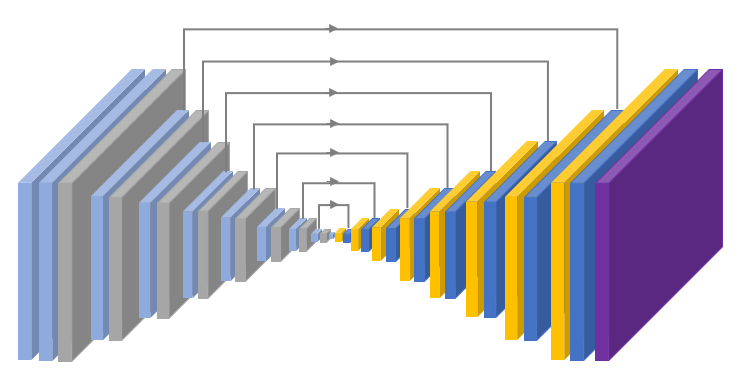
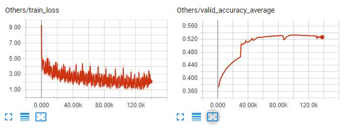
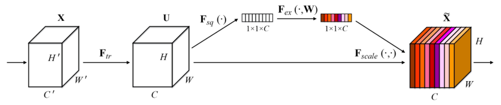
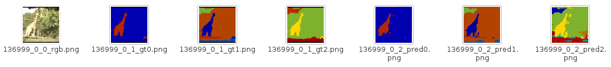

# 2017_coco_stuff
http://cocodataset.org/#stuff-challenge2017

# Results

## Encode-decoder

- The most basic model
- Seems it reach it's upper bound
- The learning matters a lot

## Squeeze-and-Excitation
-  The network uses the Squeeze-and-Excitation (https://github.com/hujie-frank/SENet) technique to improve the performance.

## Label Hierarchy

- According to [Label Hierarchy](https://github.com/nightrome/cocostuff#label-hierarchy)
- From left to right [image, gt1, gt2, g3, predict1, predict2, predict3]
    1. Hierarchy: first predict indoor or outdoor, then plant, and then tree.
    2. Multi-task: network predict different level labels at the same time.

## SE

## Dilated

