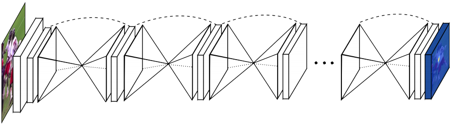

# 2017_coco_stuff
http://cocodataset.org/#stuff-challenge2017

# Models
- Encode-decoder (ae)
- Stacked Hourglass (stack)
- Squeeze-and-Excitation (se)
- Label Hierarchy (multi)

## Encode-decoder

- The basic model
- tedt-dev2017 mIoU: 0.1234

## Label Hierarchy

- According to [Label Hierarchy](https://github.com/nightrome/cocostuff#label-hierarchy)
- From left to right [image, gt1, gt2, g3, predict1, predict2, predict3]
- Aluxary loss
    1. Hierarchy: first predict indoor or outdoor, then plant, and then tree.
    2. Multi-task: network predict different level labels at the same time.
- tedt-dev2017 mIoU: 0.1049 
    
## Squeeze-and-Excitation

- The network uses the Squeeze-and-Excitation(https://github.com/hujie-frank/SENet) technique to improve the performance.
- tedt-dev2017 mIoU:  0.1230 

## Stacked Hourglass

- The network imitate Stacked Hourglass Networks (https://arxiv.org/abs/1603.06937)
- Two consecutive stack, and one intermediate supervision.
- test-dev2017 mIoU: 0.1245 

# Conclusion
## Base model

- Seems it reach it's upper bound
- The learning matters a lot
- Is our network too simple and it reach it's limit?
## Improve method?

- Seems all models have no significant differences
- Why there is no improvement after many different modified?
- The other factors except network itself seems having much more affection(all model have increased noticeable performance
 after learning rate changed, and shortly decrease when data augmentation is applied)
 
 ## More paramether?
 
 - Is more parameter and more complex and deeper model the only way to increase accuracy?
 - DenseNet, ResNet, Dilation are very attractive, but I feel hard when I train it from scratch.
 - I don't have enough time to observe their performance while they may take couples of hour to train.
 - A pretrain model is worth to try   

- 

## Dilated